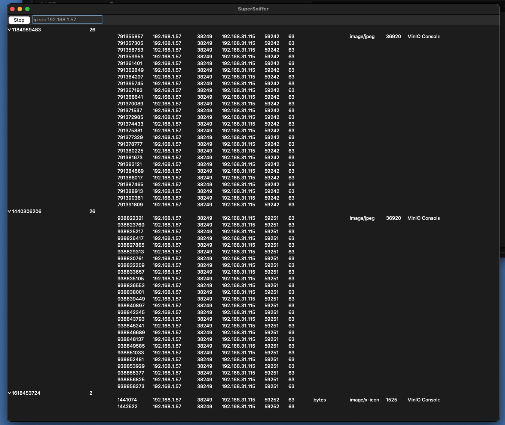

# SuperSniffer

基于Scapy进行嗅探并自动提取资源. 中间人攻击中很有用.

## 开发计划:
* 把filter参数的传递从命令行参数改成GUI控件来输入.
* 利用 [CustomTkinter](https://github.com/TomSchimansky/CustomTkinter) 优化其GUI.
* 利用 [TkinterDesigner](https://github.com/ParthJadhav/Tkinter-Designer) 提高GUI开发效率.
* 利用 [Sun-Valley-ttk-theme](https://github.com/rdbende/Sun-Valley-ttk-theme) 优化其GUI.

## 鸣谢&引用

* thanks to [secdev](https://github.com/secdev) for [secdev/scapy](https://github.com/secdev/scapy)
* thanks to python developers for tkinter.

## 链接

* [Scapy文档](https://scapy.readthedocs.io/en/latest)
